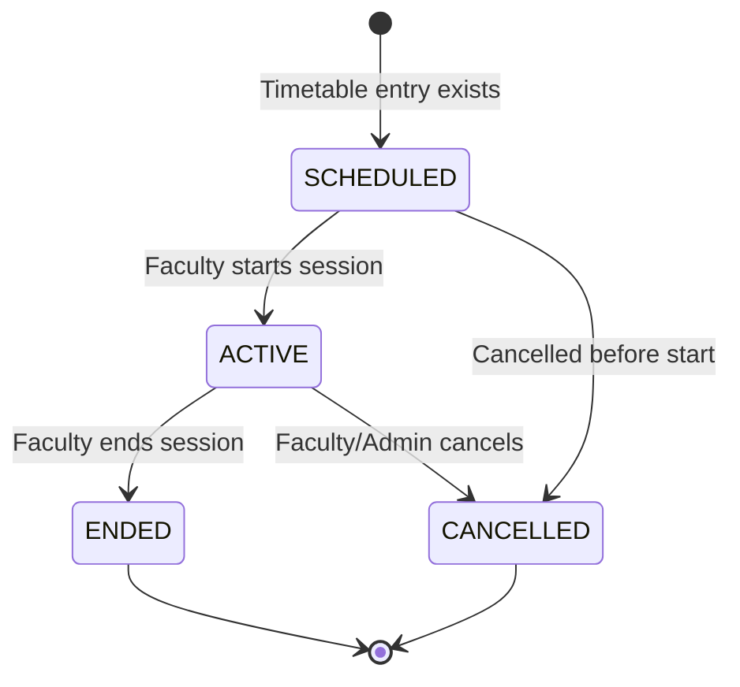
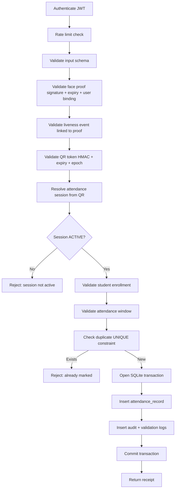

# Attendance Protocol — SecureAttend AI

## Overview

This document defines the secure attendance marking protocol. The backend is the sole authority; clients never mark attendance locally.

## Prerequisites

Before a student can mark attendance:

1. Active user account with STUDENT role
2. Active face profile (Admin-enrolled)
3. Enrolled in the subject/division for the session's timetable entry
4. Active attendance session (status = ACTIVE)
5. Valid dynamic QR token for current epoch
6. Recent successful liveness verification event
7. Valid, non-expired face verification proof
8. Current time within attendance window

## Attendance Session State Machine



### Valid Transitions

| From | To | Actor | Condition |
|------|----|-------|-----------|
| SCHEDULED | ACTIVE | FACULTY | Authorized for timetable entry |
| ACTIVE | ENDED | FACULTY | Session owner |
| ACTIVE | CANCELLED | FACULTY, ADMIN | Before any marks or with audit |
| SCHEDULED | CANCELLED | FACULTY, ADMIN | — |

## Marking Endpoint

```
POST /api/v1/student/attendance/mark/mark
```

### Request

```json
{
  "qr_token": "eyJ...",
  "face_verification_proof": "eyJ...",
  "device_identifier_hash": "sha256:abc123...",
  "client_timestamp": "2026-07-07T10:30:00Z"
}
```

### Processing Order



**Critical:** Steps D through K (including AI-related proof validation) occur **before** opening the SQLite write transaction. AI inference for face verification happens in the `/face-verification/verify` step, not during marking.

## Attendance Window

Configurable via system settings:

| Setting | Default |
|---------|---------|
| `ATTENDANCE_WINDOW_MINUTES_BEFORE` | 10 |
| `ATTENDANCE_WINDOW_MINUTES_AFTER` | 15 |

Window is relative to the timetable entry's scheduled start/end time.

## Duplicate Prevention

Database constraint:

```sql
UNIQUE(attendance_session_id, student_id)
```

Concurrent requests:

1. Both pass pre-transaction validation
2. First transaction commits successfully
3. Second receives `attendance/already-marked` (HTTP 409)

Implementation uses SQLite transaction with immediate constraint check.

## Attendance Receipt

Success response includes:

```json
{
  "success": true,
  "data": {
    "receipt_id": "att_20260707_001",
    "attendance_record_id": 1234,
    "attendance_session_id": 56,
    "student_id": 789,
    "status": "PRESENT",
    "marked_at": "2026-07-07T10:30:15Z",
    "subject_name": "Data Structures",
    "faculty_name": "Dr. Smith"
  }
}
```

## Attendance Record Status

| Status | Description |
|--------|-------------|
| PRESENT | Successfully marked via mobile |
| ABSENT | Default for enrolled students not marked |
| LATE | Optional; marked after grace period |
| EXCUSED | Admin manual correction |
| MANUAL_PRESENT | Admin manual correction |

## Manual Corrections (Admin)

Admin corrections via Admin Portal:

- Store reason, admin identity, timestamp, old value, new value
- Create immutable audit event
- Record in `attendance_corrections` table

## Live Faculty Updates

When attendance is marked:

- Faculty polling endpoint (`GET .../live`) reflects updated counts
- Present/absent lists updated on next poll (5s interval recommended)

## Error Codes

See [ERROR_CODES.md](../api/ERROR_CODES.md) for attendance-related codes.

## Security Limitations

See [LIMITATIONS.md](../research/LIMITATIONS.md). QR tokens can be shared within their short lifetime. Mitigations include short expiry, face verification, liveness, and duplicate prevention.
