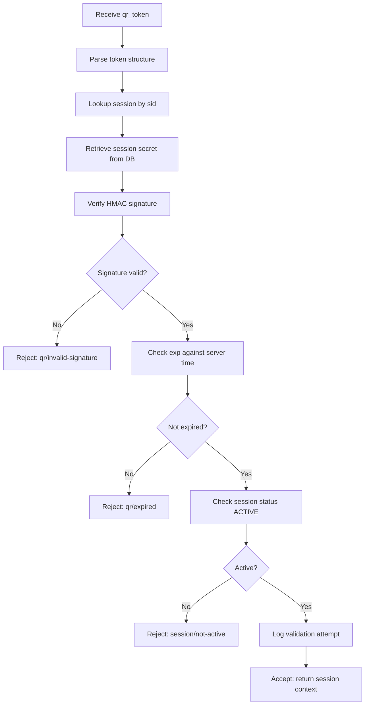

# Dynamic QR Authentication Design — SecureAttend AI

## Overview

Dynamic QR authentication provides time-limited, cryptographically signed tokens that students scan to bind their attendance mark to an active faculty session.

## Design Principles

1. **Server authority** — QR tokens are generated and validated only on the backend
2. **No secret exposure** — Raw session secrets never sent to clients
3. **Multi-scan support** — Same epoch token can be scanned by many students
4. **Short lifetime** — Default 15-second rotation
5. **Replay resistance within epoch** — Nonce + expiry prevent stale reuse beyond tolerance

## Session Secret Generation

When faculty starts an attendance session:

1. Create `attendance_sessions` row (status = ACTIVE)
2. Generate `qr_session_secrets` row:
   - `secret`: 32 bytes from `secrets.token_bytes(32)`, stored as hex
   - `session_id`: FK to attendance session
   - `created_at`: timestamp

The raw secret is **never** included in API responses to React or Flutter.

## QR Epoch Model

Time is divided into epochs based on rotation interval:

```
epoch = floor(unix_timestamp / QR_ROTATION_INTERVAL_SECONDS)
```

Default interval: **15 seconds**.

Each epoch produces a new QR token for the same session. Previous epoch tokens remain valid until their individual expiry (with clock skew tolerance).

## QR Token Structure

QR token is a base64url-encoded JSON Web Token-like structure (signed payload):

### Payload Claims

| Claim | Type | Description |
|-------|------|-------------|
| `sid` | int | Attendance session ID |
| `epoch` | int | Current QR epoch number |
| `iat` | int | Issued at (Unix timestamp) |
| `exp` | int | Expiration (iat + rotation interval + skew tolerance) |
| `ver` | int | Token format version (1) |
| `nonce` | string | Random 16-byte hex per token |

### Signing

```
signature = HMAC-SHA256(
  key = session_secret,
  message = base64url(header) + "." + base64url(payload)
)
```

Token format:

```
{base64url(header)}.{base64url(payload)}.{base64url(signature)}
```

## Faculty QR Retrieval

```
GET /api/v1/faculty/attendance-sessions/{session_id}/qr
```

Response:

```json
{
  "success": true,
  "data": {
    "qr_token": "eyJhbGci...",
    "epoch": 12345678,
    "issued_at": "2026-07-07T10:30:00Z",
    "expires_at": "2026-07-07T10:30:15Z",
    "rotation_interval_seconds": 15,
    "session_id": 56
  }
}
```

### Polling Strategy (Flutter)

Antigravity should poll this endpoint every **12 seconds** (3 seconds before expiry) rather than using a separate refresh endpoint. See [BACKEND_API_CHANGE_REQUESTS_RESPONSE.md](../api/BACKEND_API_CHANGE_REQUESTS_RESPONSE.md).

## QR Display

The Flutter app renders `qr_token` string as a QR code. The QR encodes the opaque token string — no local signing.

## Validation Flow



## Validation Logging

Every validation attempt (success or failure) creates a `qr_validation_logs` record:

- `attendance_session_id`
- `student_id` (if authenticated)
- `qr_epoch`
- `result` (VALID, EXPIRED, INVALID_SIGNATURE, SESSION_INACTIVE)
- `client_ip`
- `timestamp`

## Clock Skew Tolerance

Default: **5 seconds** (`QR_CLOCK_SKEW_TOLERANCE_SECONDS`).

Tokens are accepted if `server_time <= exp + skew_tolerance`.

## Multi-Student Scanning

The same QR token for a given epoch can be scanned by unlimited students within the validity window. The token is **not** invalidated after first scan.

Attendance uniqueness is enforced at the attendance record level, not the QR level.

## Threat Considerations

| Threat | Mitigation | Residual Risk |
|--------|-----------|---------------|
| QR screenshot sharing | 15s expiry, face verification required | Remote sharing within window |
| Token forgery | HMAC with server-only secret | None if secret protected |
| Replay after expiry | exp claim + epoch | Low |
| Session hijacking | Faculty auth required to start | Low |

## Configuration

| Setting | Default | Description |
|---------|---------|-------------|
| `QR_ROTATION_INTERVAL_SECONDS` | 15 | Epoch duration |
| `QR_CLOCK_SKEW_TOLERANCE_SECONDS` | 5 | Acceptable clock drift |
| `QR_HMAC_SECRET_KEY` | (env) | Global HMAC pepper (optional additional layer) |

## Version Migration

Token format version (`ver`) allows future algorithm changes. Version 1 uses HMAC-SHA256 as described.
