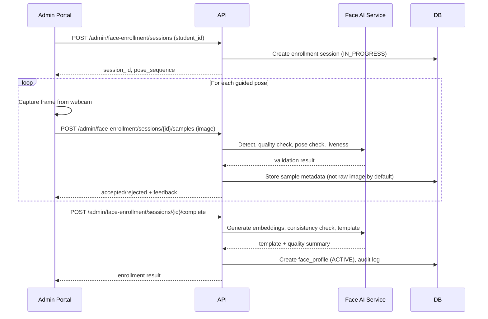

# Face Enrollment Design — SecureAttend AI

## Overview

Face enrollment is an **Admin-only** operation performed through the React Admin Web Portal using the laptop webcam. Students never self-enroll.

## Actors

| Actor | Action |
|-------|--------|
| ADMIN | Initiates enrollment, operates webcam, reviews results |
| Backend | Validates samples, generates template, stores profile |
| Student | Present during capture (physical presence expected) |

## Workflow



## Guided Pose Sequence

Default configurable sequence:

| Step | Pose | Instruction |
|------|------|-------------|
| 1 | STRAIGHT | Look straight at the camera |
| 2 | LEFT | Turn head slightly left (~15°) |
| 3 | RIGHT | Turn head slightly right (~15°) |
| 4 | UP | Look slightly upward (~10°) |
| 5 | DOWN | Look slightly downward (~10°) |

Target: **5–10 accepted samples** across poses.

## Per-Sample Validation

| Check | Threshold (configurable) | Rejection Code |
|-------|-------------------------|----------------|
| Image decodes | Valid JPEG/PNG | `face-enrollment/invalid-image` |
| Exactly one face | count == 1 | `face-enrollment/no-face` or `face-enrollment/multiple-faces` |
| Face size | min 80x80 px in frame | `face-enrollment/face-too-small` |
| Blur score | Laplacian variance > 50 | `face-enrollment/too-blurry` |
| Brightness | Mean pixel 40–220 | `face-enrollment/poor-lighting` |
| Detection confidence | > 0.7 | `face-enrollment/low-confidence` |
| Pose match | Within tolerance of requested | `face-enrollment/pose-mismatch` |
| Duplicate sample | Cosine similarity < 0.95 vs prior | `face-enrollment/duplicate-sample` |

## Enrollment Liveness

Basic enrollment liveness (Phase 4):

- Require at least one blink detection across samples, OR
- Require head movement between LEFT and RIGHT poses with measurable yaw change

This is a lightweight check, not production anti-spoof. Documented in [LIVENESS_DESIGN.md](./LIVENESS_DESIGN.md).

## Template Generation

1. Generate 512-dim embedding for each accepted sample
2. Compute pairwise cosine similarity matrix
3. Reject if any pair similarity < 0.5 (different person suspected)
4. Reject if mean similarity < 0.7 (inconsistent captures)
5. Final template = L2-normalized mean of accepted embeddings
6. Store as float32 BLOB

## Storage Format

```python
# Serialization (never use pickle)
embedding_bytes = template.astype(np.float32).tobytes()

# Deserialization with safety checks
embedding = np.frombuffer(blob, dtype=np.float32)
assert embedding.shape == (embedding_dim,)
assert embedding.dtype == np.float32
```

### face_profiles Metadata

| Column | Description |
|--------|-------------|
| `embedding` | float32 BLOB |
| `embedding_dim` | 512 |
| `embedding_dtype` | "float32" |
| `model_name` | "buffalo_sc" |
| `model_version` | "1.0" |
| `preprocessing_version` | "1.0" |
| `sample_count` | Number of accepted samples |
| `quality_summary` | JSON (mean similarity, blur avg, etc.) |
| `status` | PENDING, ACTIVE, DEACTIVATED |
| `activated_at` | Timestamp |

## Re-Enrollment

1. Existing ACTIVE profile remains active during new enrollment
2. New enrollment session captures fresh samples
3. On successful completion:
   - Transaction: activate new profile, deactivate old profile
   - Audit event records both profile IDs

## Privacy

- Raw images deleted after processing by default (`BIOMETRIC_SAMPLE_RETENTION_DAYS=0`)
- Only embeddings and quality metadata persisted
- Admin can delete face profile per privacy policy

## Admin Webcam Component

React component requirements (Phase 4):

- `navigator.mediaDevices.getUserMedia({ video: { facingMode: 'user' } })`
- Live preview with pose instruction overlay
- Capture button + auto-capture option
- Sample status grid (accepted/rejected)
- Error feedback from backend validation

## API Endpoints (Admin)

| Method | Path | Description |
|--------|------|-------------|
| POST | `/api/v1/admin/face-enrollment/sessions` | Start session |
| POST | `/api/v1/admin/face-enrollment/sessions/{id}/samples` | Submit sample |
| GET | `/api/v1/admin/face-enrollment/sessions/{id}` | Session status |
| POST | `/api/v1/admin/face-enrollment/sessions/{id}/complete` | Finalize enrollment |
| DELETE | `/api/v1/admin/face-enrollment/profiles/{id}` | Deactivate/delete profile |

Mobile endpoints are separate — see [FACE_VERIFICATION_DESIGN.md](./FACE_VERIFICATION_DESIGN.md).
