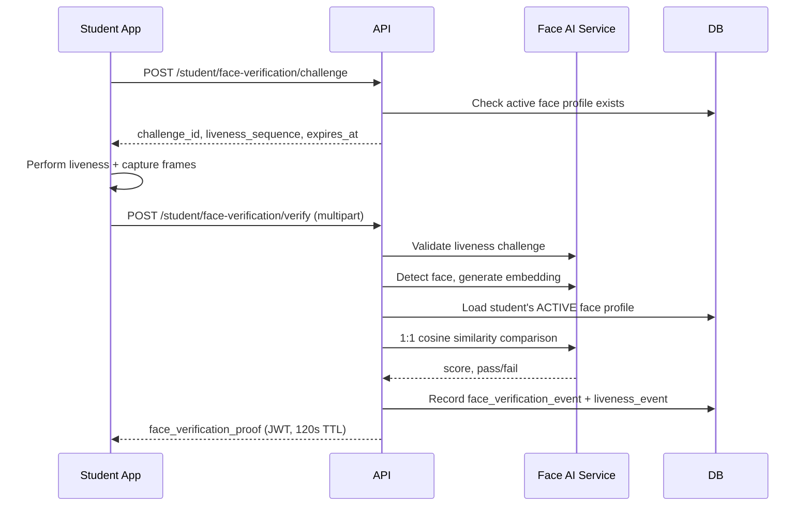

# Face Verification Design — SecureAttend AI

## Overview

Face verification confirms that the authenticated student presenting for attendance matches their Admin-enrolled face template. Verification occurs on the **Student mobile app** with images sent to the backend.

## Design Principles

1. Backend performs all matching — client never receives embeddings or threshold
2. Only the authenticated student's active profile is retrieved
3. Successful verification yields a short-lived cryptographic proof
4. Proof is required for attendance marking
5. Never accept client-provided `face_verified=true`

## Workflow



## Challenge Endpoint

```
POST /api/v1/student/face-verification/challenge
```

Generates a randomized liveness sequence:

```json
{
  "success": true,
  "data": {
    "challenge_id": "fc_abc123",
    "liveness_sequence": [
      { "action": "LOOK_STRAIGHT", "instruction": "Look straight at the camera", "duration_seconds": 3 },
      { "action": "BLINK", "instruction": "Blink naturally", "duration_seconds": 3 },
      { "action": "TURN_LEFT", "instruction": "Turn your head slightly left", "duration_seconds": 3 }
    ],
    "expires_at": "2026-07-07T10:29:00Z",
    "max_images": 5
  }
}
```

## Verify Endpoint

```
POST /api/v1/student/face-verification/verify
Content-Type: multipart/form-data
```

### Form Fields

| Field | Type | Required | Description |
|-------|------|----------|-------------|
| `challenge_id` | string | Yes | From challenge response |
| `images` | file[] | Yes | 1–5 JPEG frames |
| `device_identifier_hash` | string | No | SHA-256 of device ID for audit |

### Processing

1. Validate challenge_id not expired
2. Validate liveness sequence completion (see [LIVENESS_DESIGN.md](./LIVENESS_DESIGN.md))
3. Select best quality frame (highest detection confidence, acceptable blur)
4. Generate live embedding
5. Load authenticated student's ACTIVE face profile only
6. Verify model compatibility (model_name, embedding_dim must match)
7. Compute cosine similarity
8. Compare against `FACE_VERIFICATION_THRESHOLD` (default 0.45 for ArcFace cosine)
9. Record events regardless of outcome

### Success Response

```json
{
  "success": true,
  "data": {
    "verified": true,
    "face_verification_proof": "eyJhbGci...",
    "proof_expires_at": "2026-07-07T10:31:00Z",
    "verification_event_id": 456
  }
}
```

### Failure Response

```json
{
  "success": false,
  "error": {
    "code": "face-verification/mismatch",
    "message": "Face verification failed. Please try again in good lighting."
  }
}
```

## Face Verification Proof

Short-lived signed JWT (HS256 with `FACE_PROOF_SECRET_KEY`):

### Claims

| Claim | Description |
|-------|-------------|
| `sub` | User ID |
| `student_id` | Student profile ID |
| `verification_event_id` | FK to face_verification_events |
| `liveness_event_id` | FK to liveness_verification_events |
| `purpose` | Always `"attendance"` |
| `iat` | Issued at |
| `exp` | Expiry (default 120 seconds) |
| `jti` | Unique proof ID (single-use optional in Phase 7) |

Proof is validated during attendance marking without re-running face inference.

## 1:1 Comparison

```python
similarity = np.dot(live_embedding, stored_embedding)  # Both L2-normalized
passed = similarity >= threshold
```

Threshold configurable via Admin system settings.

## Model Compatibility

Before comparison, verify:

- `face_profile.model_name == current_model.name`
- `face_profile.embedding_dim == current_model.dim`
- `face_profile.embedding_dtype == "float32"`

Mismatch returns `face-verification/model-incompatible` — student needs re-enrollment.

## Event Recording

`face_verification_events`:

| Column | Description |
|--------|-------------|
| `student_id` | FK |
| `challenge_id` | Reference |
| `result` | PASS, FAIL, ERROR |
| `similarity_score` | Float (not exposed to client on fail) |
| `threshold_used` | Float |
| `model_name` | String |
| `failure_reason` | Nullable string |
| `created_at` | Timestamp |

## Security Rules

- Never return stored embedding to any client
- Never return similarity score to client on failure (prevent threshold probing)
- Rate limit verification attempts (5 per minute per student)
- Proof bound to authenticated user — cannot be transferred

## No Active Profile

If student has no ACTIVE face profile:

```json
{
  "success": false,
  "error": {
    "code": "face-verification/no-profile",
    "message": "Face enrollment required. Contact your administrator."
  }
}
```

## AI Model

See [AI_MODEL_SELECTION.md](../research/AI_MODEL_SELECTION.md). Initial: InsightFace buffalo_sc, 512-dim ArcFace embeddings.
