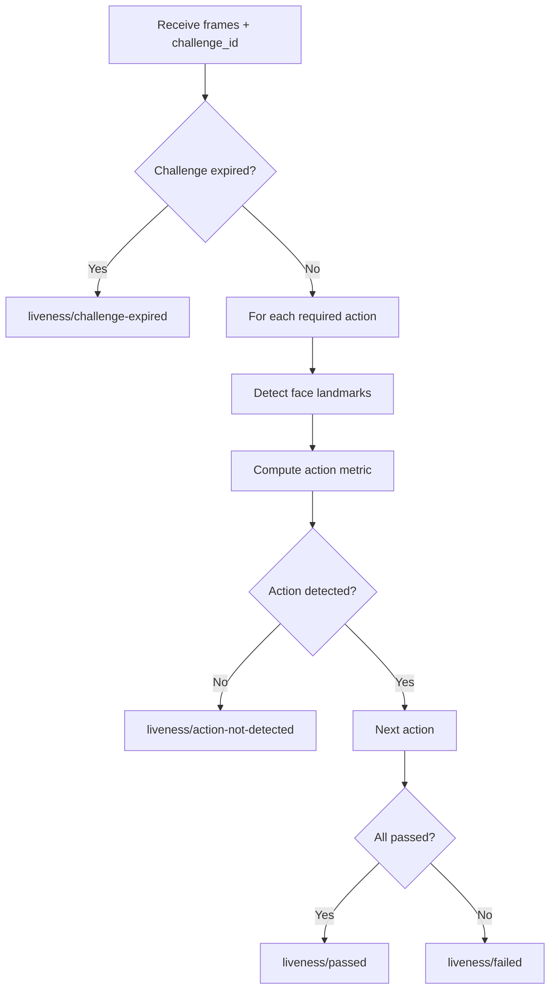

# Liveness Detection Design — SecureAttend AI

## Overview

Liveness detection verifies that a live person is present during face verification and enrollment. The initial implementation uses **challenge-response** with basic computer vision heuristics. The interface is designed to be replaceable with stronger anti-spoofing models.

## Design Principles

1. **Modular adapter interface** — swap implementations without API changes
2. **Server-side validation** — client sends frames; backend decides pass/fail
3. **Randomized challenges** — prevent scripted replay
4. **Honest limitations** — academic-grade, not production anti-spoof

## Liveness Adapter Interface

```python
class LivenessAdapter(Protocol):
    def generate_challenge(self) -> LivenessChallenge: ...
    def validate_challenge(
        self,
        challenge: LivenessChallenge,
        frames: list[ImageFrame],
    ) -> LivenessResult: ...
```

## Challenge Actions

| Action | Detection Method | Enrollment | Attendance |
|--------|-----------------|------------|------------|
| LOOK_STRAIGHT | Face detected, yaw/pitch near zero | Yes | Yes |
| BLINK | Eye aspect ratio drop between frames | Yes | Yes |
| TURN_LEFT | Head yaw > threshold (negative) | Yes | Yes |
| TURN_RIGHT | Head yaw > threshold (positive) | Yes | Yes |
| LOOK_UP | Head pitch above threshold | Yes | No |
| LOOK_DOWN | Head pitch below threshold | Yes | No |

## Challenge Generation

Randomly select 2–3 actions from the attendance pool:

```python
ATTENDANCE_ACTIONS = ["LOOK_STRAIGHT", "BLINK", "TURN_LEFT", "TURN_RIGHT"]
sequence = random.sample(ATTENDANCE_ACTIONS, k=random.randint(2, 3))
# Always start with LOOK_STRAIGHT
sequence.insert(0, "LOOK_STRAIGHT")
```

Challenge stored with:

- `challenge_id` (UUID)
- `sequence` (JSON)
- `expires_at` (60 seconds default)
- `user_id`

## Validation Pipeline



## Detection Methods (Phase 4/5)

### Blink Detection

Eye Aspect Ratio (EAR):

```
EAR = (|p2-p6| + |p3-p5|) / (2 * |p1-p4|)
```

Blink detected when EAR drops below threshold for 1–2 frames then recovers.

### Head Turn Detection

Use facial landmark yaw estimation:

- LEFT: yaw < -15°
- RIGHT: yaw > 15°

Landmarks from InsightFace model (same pipeline as face detection).

## Scoring

| Field | Description |
|-------|-------------|
| `score` | 0.0–1.0 composite score |
| `threshold` | Configurable (default 0.6) |
| `actions_completed` | List of detected actions |
| `actions_required` | List from challenge |

Pass if all required actions detected AND score >= threshold.

## Event Recording

`liveness_verification_events`:

| Column | Description |
|--------|-------------|
| `user_id` | FK |
| `challenge_id` | Reference |
| `challenge_sequence` | JSON |
| `result` | PASS, FAIL |
| `score` | Float |
| `model_name` | "challenge_response_v1" |
| `model_version` | "1.0" |
| `failure_reason` | Nullable |
| `created_at` | Timestamp |

## Limitations

| Limitation | Impact |
|-----------|--------|
| No depth sensing | Photo/video replay may fool basic checks |
| No IR camera | Screen replay not detected |
| Heuristic blink | Can be simulated with edited video |
| CPU-only | Limits model complexity |

**This implementation is suitable for academic demonstration, not production biometric security.**

## Future Replacement Path

The adapter interface supports plugging in:

- MiniFASNet (silent face anti-spoofing)
- MediaPipe face mesh with temporal analysis
- Hardware-backed liveness (device attestation)

API contract remains unchanged — only backend adapter changes.

## Configuration

| Setting | Default |
|---------|---------|
| `LIVENESS_CHALLENGE_EXPIRE_SECONDS` | 60 |
| `LIVENESS_PASS_THRESHOLD` | 0.6 |

## Error Codes

- `liveness/challenge-expired`
- `liveness/challenge-not-found`
- `liveness/action-not-detected`
- `liveness/failed`
- `liveness/no-face-in-frames`

See [ERROR_CODES.md](../api/ERROR_CODES.md).
