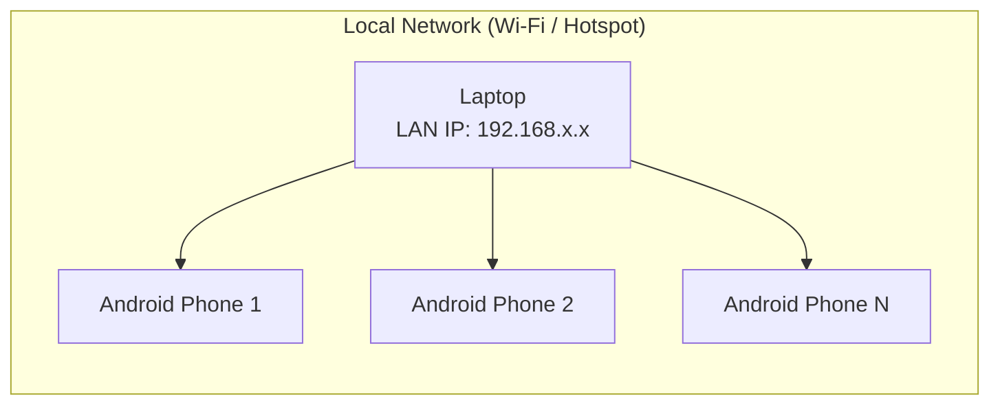

# Local Network Deployment — SecureAttend AI

## Overview

SecureAttend AI is designed for demonstration on a single laptop serving both the Admin Web Portal and FastAPI backend, with Android phones connecting over the same Wi-Fi network or mobile hotspot.

## Network Topology



## Service Binding

| Service | Bind Address | Port | Notes |
|---------|-------------|------|-------|
| FastAPI Backend | `0.0.0.0` | 8000 | Must NOT bind to `127.0.0.1` only |
| Admin Web (Vite dev) | `0.0.0.0` | 5173 | Dev server; production build served by backend or nginx |
| Admin Web (production) | `0.0.0.0` | 8080 | Optional static file server |

**Critical:** Physical Android devices cannot reach `localhost` or `127.0.0.1` on the laptop. They must use the laptop's LAN IP.

## Finding the Laptop LAN IP

### Windows

```powershell
ipconfig
```

Look for `IPv4 Address` under your active Wi-Fi adapter (e.g., `192.168.1.105`).

### Linux / macOS

```bash
ip addr show
# or
ifconfig
```

## URL Configuration

| Client | Base URL Example |
|--------|-----------------|
| Admin Portal (browser on laptop) | `http://localhost:5173` |
| Admin Portal API calls | `http://localhost:8000/api/v1` |
| Flutter APK (physical device) | `http://192.168.1.105:8000/api/v1` |
| Flutter APK (Android emulator) | `http://10.0.2.2:8000/api/v1` |
| Health check (from phone browser) | `http://192.168.1.105:8000/api/v1/health` |

### Flutter Configuration

Pass at build/run time:

```bash
flutter run --dart-define=API_BASE_URL=http://192.168.1.105:8000/api/v1
```

## Firewall Configuration

### Windows Defender Firewall

Allow inbound TCP on ports 8000 and 5173 for Private networks:

```powershell
New-NetFirewallRule -DisplayName "SecureAttend API" -Direction Inbound -Protocol TCP -LocalPort 8000 -Action Allow -Profile Private
New-NetFirewallRule -DisplayName "SecureAttend Admin Dev" -Direction Inbound -Protocol TCP -LocalPort 5173 -Action Allow -Profile Private
```

### Linux (ufw)

```bash
sudo ufw allow 8000/tcp
sudo ufw allow 5173/tcp
```

## CORS Configuration

Development `.env`:

```
CORS_ORIGINS=http://localhost:5173,http://127.0.0.1:5173,http://192.168.1.105:5173
```

Mobile apps do not use CORS (native HTTP client). CORS applies only to the Admin Web Portal browser.

## Startup Sequence (Phase 1+)

```bash
# Terminal 1 — Backend
cd backend
python -m uvicorn app.main:app --host 0.0.0.0 --port 8000 --reload

# Terminal 2 — Admin Portal (dev)
cd apps/admin-web
npm run dev -- --host 0.0.0.0
```

Or use `scripts/start-local-network.sh` / `scripts/start-local-network.ps1` (Phase 1).

## Connectivity Troubleshooting

| Symptom | Likely Cause | Fix |
|---------|-------------|-----|
| Phone cannot reach API | Wrong IP or firewall | Verify IP with `ipconfig`, check firewall rules |
| Connection refused | Backend bound to 127.0.0.1 | Use `--host 0.0.0.0` |
| CORS error in Admin Portal | Origin not in CORS_ORIGINS | Add laptop IP origin to `.env` |
| Intermittent timeouts | Wi-Fi congestion | Move closer to router; reduce concurrent uploads |
| IP changed after reconnect | DHCP reassignment | Update Flutter `--dart-define` with new IP |
| Emulator works, phone doesn't | Using 10.0.2.2 on physical device | Use actual LAN IP on physical device |

## Health Check

```bash
curl http://192.168.1.105:8000/api/v1/health
```

Expected response:

```json
{
  "success": true,
  "data": {
    "status": "healthy",
    "version": "0.1.0",
    "database": "connected"
  }
}
```

## Mobile Hotspot Mode

If no Wi-Fi router is available:

1. Enable mobile hotspot on the laptop (Windows 10/11 supports this).
2. Connect Android phones to the hotspot.
3. Use the hotspot adapter's IP (often `192.168.137.1` on Windows).

## Security Notes for LAN Demo

- This deployment model assumes a trusted local network.
- Do not expose ports 8000/5173 to the public internet without TLS and hardening.
- Change all default secrets in `.env` before any non-local demo.
- Document the known QR-sharing limitation in [LIMITATIONS.md](../research/LIMITATIONS.md).

## IP Change Handling

When the laptop's IP changes:

1. Restart is not required if backend binds to `0.0.0.0`.
2. Update Flutter `API_BASE_URL` dart-define.
3. Update Admin Portal `.env` if using LAN IP for API calls.
4. Re-test health endpoint from phone browser.
