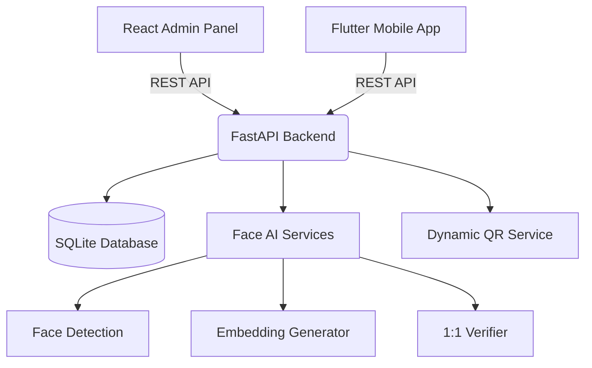
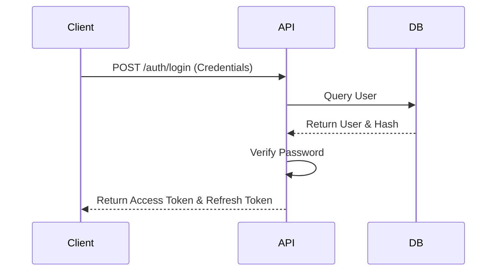
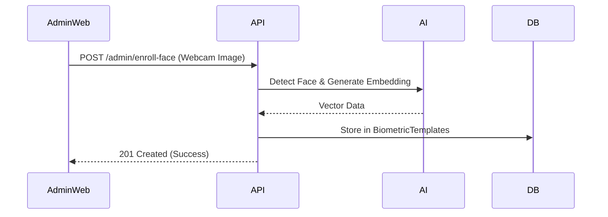
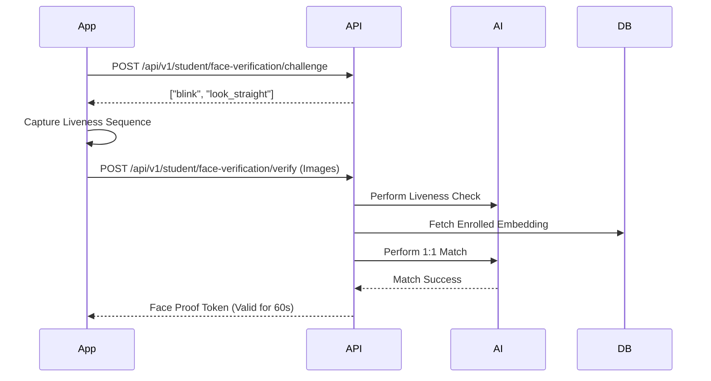
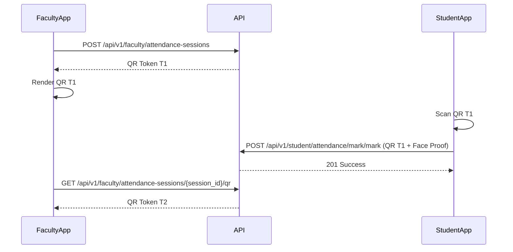
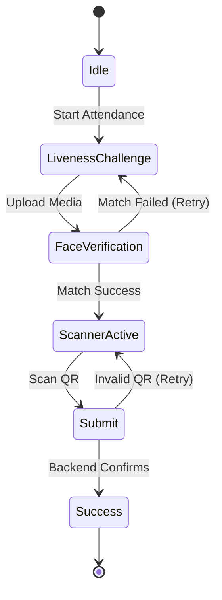
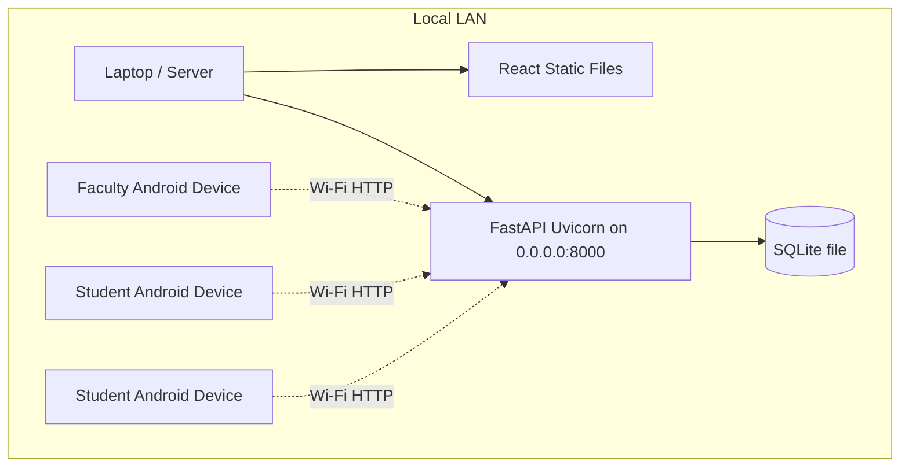

# System Architecture

## 1. Overall System Architecture

## 2. Authentication Flow

## 3. Face Enrollment Flow (Admin)

## 4. Face Verification Flow (Student)

## 5. Dynamic QR Authentication

## 6. Attendance Workflow

## 7. Deployment Architecture

