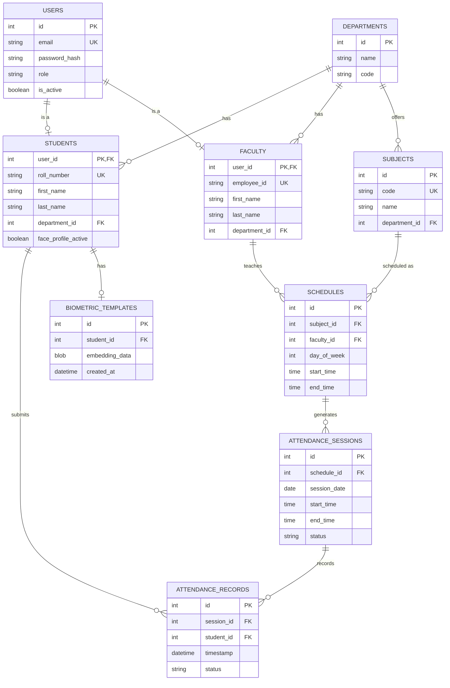

# Entity-Relationship Diagram

```mermaid
erDiagram
    USERS {
        int id PK
        string email UK
        string password_hash
        string role
        boolean is_active
    }
    STUDENTS {
        int user_id PK, FK
        string roll_number UK
        string first_name
        string last_name
        int department_id FK
        boolean face_profile_active
    }
    FACULTY {
        int user_id PK, FK
        string employee_id UK
        string first_name
        string last_name
        int department_id FK
    }
    DEPARTMENTS {
        int id PK
        string name
        string code
    }
    SUBJECTS {
        int id PK
        string code UK
        string name
        int department_id FK
    }
    SCHEDULES {
        int id PK
        int subject_id FK
        int faculty_id FK
        int day_of_week
        time start_time
        time end_time
    }
    ATTENDANCE_SESSIONS {
        int id PK
        int schedule_id FK
        date session_date
        time start_time
        time end_time
        string status
    }
    ATTENDANCE_RECORDS {
        int id PK
        int session_id FK
        int student_id FK
        datetime timestamp
        string status
    }
    BIOMETRIC_TEMPLATES {
        int id PK
        int student_id FK
        blob embedding_data
        datetime created_at
    }

    USERS ||--o| STUDENTS : "is a"
    USERS ||--o| FACULTY : "is a"
    DEPARTMENTS ||--o{ STUDENTS : "has"
    DEPARTMENTS ||--o{ FACULTY : "has"
    DEPARTMENTS ||--o{ SUBJECTS : "offers"
    SUBJECTS ||--o{ SCHEDULES : "scheduled as"
    FACULTY ||--o{ SCHEDULES : "teaches"
    SCHEDULES ||--o{ ATTENDANCE_SESSIONS : "generates"
    ATTENDANCE_SESSIONS ||--o{ ATTENDANCE_RECORDS : "records"
    STUDENTS ||--o{ ATTENDANCE_RECORDS : "submits"
    STUDENTS ||--o| BIOMETRIC_TEMPLATES : "has"
```
