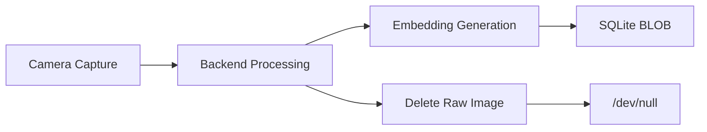

# Privacy Design — SecureAttend AI

## Biometric Data Classification

Face embeddings are **biometric identifiers** under most privacy frameworks. This system treats them as sensitive personal data.

## Data Minimization

| Data | Collected | Stored Permanently | Default Retention |
|------|-----------|---------------------|-------------------|
| Raw face images (enrollment) | Yes (transient) | No | Deleted after processing |
| Raw face images (verification) | Yes (transient) | No | Deleted after processing |
| Face embeddings | Yes | Yes | Until profile deactivated/deleted |
| Liveness frames | Yes (transient) | No | Deleted after processing |
| Device identifier hash | Yes | Yes (audit) | Life of attendance record |
| Attendance records | Yes | Yes | Academic record retention |

## Enrollment Privacy

- Only Admin can initiate enrollment
- Student must be physically present (operational policy, not technical guarantee)
- Raw images not persisted by default (`BIOMETRIC_SAMPLE_RETENTION_DAYS=0`)
- Enrollment audit events record who initiated, when, outcome

## Verification Privacy

- Live capture images processed in memory, not written to disk
- Verification events store result metadata, not images
- Similarity scores stored server-side for audit, not exposed to client on failure

## Storage Security

- Embeddings stored as float32 BLOB (not pickle)
- Explicit dtype and dimension checks on deserialization
- Face profiles soft-deactivated, not immediately deleted
- Hard deletion available per privacy policy via Admin action

## Access Control

| Data | ADMIN | FACULTY | STUDENT |
|------|:-----:|:-------:|:-------:|
| Face embeddings | Indirect (enrollment UI) | No | No |
| Face enrollment status | Yes | No | Own status only |
| Verification events | Yes (audit) | No | No |
| Attendance records | Yes | Own sessions | Own records |

## Right to Deletion

Admin can:

1. Deactivate face profile (stops verification)
2. Delete face profile (removes embedding BLOB)
3. Deactivate user account

Attendance records may be retained per institutional policy even after profile deletion.

## Consent Model

For academic demonstration:

- Students are informed that biometric enrollment is required for attendance
- Enrollment performed by Admin with student present
- No self-enrollment to prevent uninformed consent bypass

## Data Flow

## Logging Privacy

- Audit logs must not contain raw biometric data
- Passwords never logged
- Tokens logged as truncated hashes only in debug mode

## Configuration

| Setting | Default | Description |
|---------|---------|-------------|
| `BIOMETRIC_SAMPLE_RETENTION_DAYS` | 0 | Days to retain raw samples (0 = none) |

## Compliance Notes

This is an academic project. Production deployment would require:

- Formal privacy impact assessment
- Consent documentation
- Data retention policy aligned with local regulations
- Encryption at rest for biometric data
- TLS in transit

See [LIMITATIONS.md](../research/LIMITATIONS.md) for scope boundaries.
