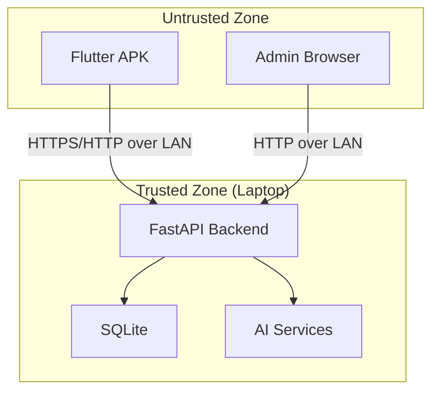

# Threat Model — SecureAttend AI

## Scope

Local-network academic attendance system with Admin web portal, FastAPI backend, and Flutter mobile clients.

## Assets

| Asset | Sensitivity | Storage |
|-------|------------|---------|
| User credentials | High | SQLite (Argon2 hash) |
| JWT secrets | Critical | Environment variables |
| Face embeddings | High | SQLite BLOB |
| QR session secrets | High | SQLite (server-only) |
| Attendance records | Medium | SQLite |
| Audit logs | Medium | SQLite |

## Trust Boundaries

Mobile clients and browsers are **untrusted**. All security decisions occur in the backend.

## Threat Actors

| Actor | Capability | Motivation |
|-------|-----------|------------|
| Student proxy | Medium | Mark attendance for absent friend |
| Remote student | Medium | Receive QR screenshot via messaging |
| Malicious student | Low–Medium | Forge API requests, replay tokens |
| Insider admin | High | Access all data |
| Network eavesdropper | Low (LAN) | Intercept tokens over unencrypted HTTP |

## STRIDE Analysis

### Spoofing

| Threat | Mitigation | Residual |
|--------|-----------|----------|
| Login with stolen credentials | Argon2, rate limiting | Password sharing |
| JWT forgery | HS256 with server secret | Secret compromise |
| Face spoof with photo | Liveness challenge | Basic liveness bypassable |
| QR token forgery | HMAC with session secret | None if secret protected |

### Tampering

| Threat | Mitigation | Residual |
|--------|-----------|----------|
| Modify attendance request | Server-side validation of all inputs | None |
| Client claims face_verified=true | Backend ignores client boolean | None |
| Replay old QR token | Expiry + epoch validation | Within skew window |
| Replay face proof | Short TTL + user binding | Within 120s window |

### Repudiation

| Threat | Mitigation | Residual |
|--------|-----------|----------|
| Deny marking attendance | Audit logs + attendance records | None |
| Deny face enrollment | Enrollment audit events | None |

### Information Disclosure

| Threat | Mitigation | Residual |
|--------|-----------|----------|
| Embedding extraction via API | Never exposed in responses | None |
| Similarity score probing | Scores hidden on failure | Threshold probing via timing |
| QR secret exposure | Never sent to clients | DB compromise |

### Denial of Service

| Threat | Mitigation | Residual |
|--------|-----------|----------|
| Login brute force | Rate limiting | LAN-only scope limits impact |
| Concurrent attendance flood | SQLite busy timeout, rate limits | Laptop CPU bottleneck |
| Large image uploads | Size limits, timeout | Slow uploads |

### Elevation of Privilege

| Threat | Mitigation | Residual |
|--------|-----------|----------|
| Student accesses faculty endpoints | Backend RBAC | None if RBAC correct |
| Client-provided role override | Role from JWT + DB validation | None |
| Student marks for another student | JWT identity binding | None |

## Known Acceptable Risks

Documented in [LIMITATIONS.md](../research/LIMITATIONS.md):

1. **No location proof** — QR can be shared remotely within expiry window
2. **Basic liveness** — Photo/video may fool challenge-response
3. **Unencrypted HTTP** — Acceptable for LAN demo; use TLS for production
4. **Single laptop SPOF** — No HA for academic demo

## Mitigations Summary

| Control | Phase |
|---------|-------|
| Argon2 password hashing | 2 |
| JWT + refresh rotation | 2 |
| Backend RBAC | 2 |
| Rate limiting | 2 |
| Face verification proof | 5 |
| Dynamic QR with HMAC | 6 |
| Transactional attendance | 7 |
| Audit logging | 2, 8 |
| Input validation (Pydantic) | 1+ |

## Out of Scope Threats

- Nation-state adversaries
- Physical device theft with secure storage bypass
- Admin insider threat beyond audit logging
- DDoS from internet (LAN-only deployment)
