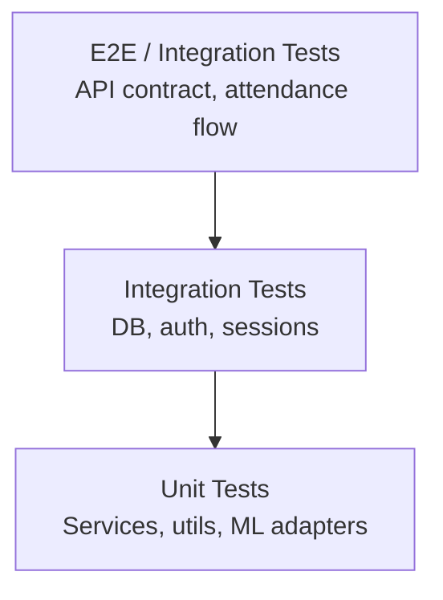

# Testing Strategy — SecureAttend AI

## Overview

Testing is organized by layer and phase. Phase 0 establishes the strategy; tests are implemented from Phase 1 onward.

## Test Pyramid



## Backend Testing

### Framework

- **Pytest** with `pytest-asyncio` for async FastAPI
- **httpx** `AsyncClient` for API testing
- **Factory pattern** for test data (Phase 2+)

### Unit Tests

| Area | Tests |
|------|-------|
| Password hashing | Argon2 hash/verify |
| JWT | Create, decode, expiry |
| QR token | HMAC sign/verify, epoch, expiry |
| Face proof | JWT creation, validation, expiry |
| Embedding serialization | float32 BLOB round-trip |
| Liveness adapter | Challenge generation, action detection mocks |
| Face adapter | Mock detection and embedding |
| Attendance window | Time boundary logic |
| RBAC | Permission checking |

### Integration Tests

| Area | Tests |
|------|-------|
| Auth flow | Login, refresh rotation, logout, revocation |
| Student CRUD | Admin creates student, student login |
| Face enrollment | Session lifecycle, sample validation |
| Face verification | Challenge → verify → proof |
| Faculty session | Create, QR, live, end |
| Attendance marking | Full flow with mocked AI |
| Duplicate attendance | Same student, same session → 409 |
| Concurrent attendance | Parallel marks, SQLite safety |
| SQLite locking | Busy timeout behavior |

### API Contract Tests

Validate every mobile endpoint against OpenAPI schema:

```python
# Phase 9: schemathesis or manual contract tests
def test_login_response_schema(): ...
def test_mark_attendance_error_codes(): ...
```

### Security Tests (Phase 9)

| Test | Expected |
|------|----------|
| Student accesses faculty endpoint | 403 |
| Expired JWT | 401 |
| Tampered QR signature | 422 qr/invalid-signature |
| Expired QR token | 422 qr/expired |
| Expired face proof | 401 attendance/face-proof-expired |
| Client-provided role in body | Ignored |
| Replay refresh token | 401 |
| Brute force login | 429 |

### AI Service Tests

| Test | Approach |
|------|----------|
| Face detection | Test images with known face count |
| Embedding consistency | Same image → same embedding |
| Verification threshold | Known match/mismatch pairs |
| Model compatibility | Dimension/dtype mismatch rejection |

Use fixture images in `tests/fixtures/face/` (synthetic or licensed test faces).

## Admin Portal Testing

### Framework

- **Vitest** + **React Testing Library**
- **MSW** (Mock Service Worker) for API mocking

### Test Categories

| Category | Examples |
|----------|---------|
| Component | Form validation, table rendering |
| Auth flow | Login, token refresh, logout redirect |
| Protected routes | Unauthenticated redirect |
| Student management | Create/edit form validation |
| Webcam enrollment | Mock getUserMedia, capture flow |
| Error handling | API error code display |

### Build Verification

```bash
cd apps/admin-web && npm run build
cd apps/admin-web && npm run typecheck
```

## Mobile Integration Testing

Owned by Antigravity, supported by Cursor:

| Test | Owner | Phase |
|------|-------|-------|
| API mock tests | Antigravity | 1–7 |
| Physical device connectivity | Both | 9 |
| Full attendance E2E | Both | 9 |
| Concurrent multi-device marking | Both | 9 |

Cursor provides:
- Running backend on LAN
- Demo seed data and credentials
- Health check endpoint

## Test Data

Phase 10 demo seed:

| Account | Role | Username | Password |
|---------|------|----------|----------|
| Admin | ADMIN | admin | (configured in seed) |
| Faculty | FACULTY | faculty001 | (configured in seed) |
| Student | STUDENT | student001 | (configured in seed) |

Never commit real passwords. Use `.env.test` for test secrets.

## CI (Future)

```yaml
# Planned CI pipeline
- lint (ruff, mypy, eslint)
- backend unit + integration tests
- admin portal build + tests
- openapi schema validation
```

## Coverage Targets

| Layer | Target |
|-------|--------|
| Auth + RBAC | 90%+ |
| QR + attendance marking | 90%+ |
| Face services | 80%+ (mocked AI) |
| Admin CRUD | 70%+ |
| Overall backend | 80%+ |

## Test Commands (Phase 1+)

```bash
# Backend
cd backend && pytest -v
cd backend && pytest tests/integration/ -v
cd backend && pytest tests/contract/ -v

# Admin
cd apps/admin-web && npm test
```

## Phase Mapping

| Phase | Tests Added |
|-------|------------|
| 1 | Health endpoint, app startup |
| 2 | Auth, RBAC, models |
| 3 | Admin CRUD APIs |
| 4 | Face enrollment |
| 5 | Student mobile APIs |
| 6 | Faculty session APIs |
| 7 | Attendance marking, concurrent |
| 8 | Reports, notifications |
| 9 | Security, contract, E2E |
| 10 | Demo seed, full suite |
